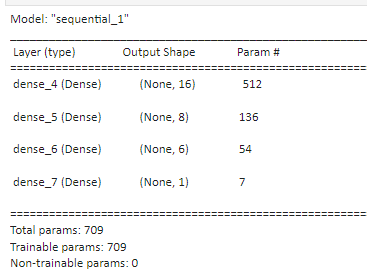
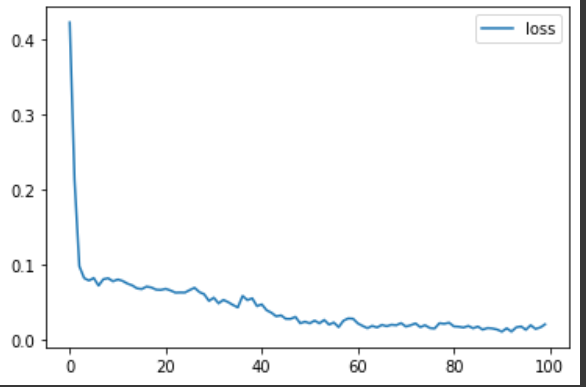
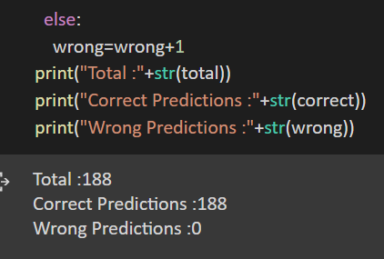

# Breast-Cancer-Detection
Breast cancer detection using neural networks and optimizing the layers for better accuracy. This project is started with the goal to use neural networks and learn how to optimize the layers so as not to overfit the model and also hopefully to help in some diagnosis.

# Basic Preprocessing
Handling missing values and Label Encoding

# Model

# loss vs epochs trend

# Results

